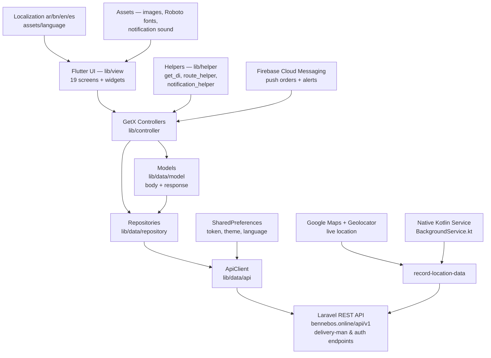

<p align="center">
  
</p>

<p align="center">
  
  
  
  
</p>

> **Developed by [Arslan Malik](https://github.com/arsalanmaalik461)**
> 📱 WhatsApp: [+92 300 8987448](https://wa.me/923008987448) · 🌐 Website: [arslanmalik.tech](https://arslanmalik.tech)

---

## 🌟 Executive Overview

**Bennebos Delivery** is a cross-platform delivery-agent app built with Flutter and Dart, designed for couriers who fulfil food/grocery delivery orders for the Bennebos platform. Riders sign in (or register as a new delivery man with their vehicle and service zone), go online/offline, receive new order requests in real time via Firebase Cloud Messaging, and manage every step of the fulfilment flow — accept or ignore requests, follow the map route, verify handovers with OTP codes, collect cash on delivery, and track their earnings — all from one clean mobile dashboard.

Under the hood the app follows a layered GetX architecture: `lib/view` holds the UI screens and reusable widgets, `lib/controller` holds nine GetX state controllers, `lib/data` wraps the Laravel REST API (`https://bennebos.online/api/v1/...`) with models, repositories and an API client, and `lib/helper` keeps dependency injection, routing, and notification helpers tidy. Native Kotlin code powers a background location service so the rider's position keeps recording during active deliveries, while Google Maps, OTP verification, in-app chat with customers, cash-in-hand accounting, disbursements/withdrawals, and 4-language localization (English, Arabic, Bangla, Spanish) round out a production-grade field tool.

---

## 📑 Table of Contents

- [✨ Key Features & Highlights](#-key-features--highlights)
- [🖥️ Feature Showcase](#️-feature-showcase)
- [🏗️ System Architecture](#️-system-architecture)
- [🚀 Quickstart & Installation Guide](#-quickstart--installation-guide)
- [📂 Project Structure](#-project-structure)
- [🛡️ Security & Notes](#️-security--notes)

---

## ✨ Key Features & Highlights

| Feature | Description |
| :--- | :--- |
| 🔐 Delivery-Man Auth | Sign in with phone/email + password, "remember me", forgot-password with OTP verification, password reset, and a full delivery-man registration flow (personal info, vehicle selection, zone selection, ID documents). |
| 📲 Live Order Requests | New order requests arrive via FCM push; riders can accept or ignore them from a dedicated request screen with order location and a map preview. |
| 🗺️ Live Location Tracking | Foreground + background location recording (`record-location-data`) with a native Kotlin background service, battery-optimization prompt, and Google Maps route/marker rendering. |
| ✅ OTP Delivery Verification | Handover completed via delivery OTP (`send-order-otp`); verify-delivery bottom sheet confirms the code before the order is closed. |
| 💵 Cash Collection & Cash in Hand | "Collect cash" flow for COD orders, cash-in-hand ledger, transaction history, wallet adjustments, and payment-method sheets. |
| 🏦 Disbursements & Withdrawals | Add/manage withdrawal methods (store, list, set default, delete), disbursement status reports, and withdraw requests. |
| 💬 In-App Chat | Two-way messaging with customers/store: conversation list, search, message bubbles with shimmer loading, image messages and photo viewer. |
| 📊 Earnings Dashboard | Home screen with earnings widget, today / this-week / total order counts, cash-in-hand summary, and order history. |
| 🔔 Push Notifications | Firebase Cloud Messaging + flutter_local_notifications with custom notification sound (`notification.mp3`), notification list screen and dialog. |
| 🌍 Multi-Language | Full localization in English, Arabic, Bangla and Spanish (`assets/language/*.json`) with a language-picker screen. |
| 🌙 Dark Mode | Light and dark themes (`lib/theme/`) with a user toggle persisted in shared preferences. |
| 🚲 Vehicle & Zone Onboarding | Riders pick from server-provided vehicles and zones during registration and profile setup. |
| 👤 Profile & Account Management | Update profile, change password, view about/privacy/terms in an HTML viewer, and self-service account removal. |
| 🔁 Update / Maintenance Mode | Force-update prompt and maintenance screens driven by the remote config endpoint. |

---

## 🖥️ Feature Showcase

### 1. Order Fulfilment Loop — from request to delivered

> "Every delivery is a state machine: request → accepted → out-for-delivery → delivered (OTP-verified)."

- **Order requests** screen shows incoming orders with store/customer locations and order value; riders accept or ignore.
- **Running order** screen tracks the active delivery with route info, order details, cancellation reasons, and a slider button to advance status.
- **OTP verification** sheet sends/validates the delivery code (`send-order-otp`) so handovers are provable.
- **Order history** keeps every completed order with fees, payment status and item breakdown.

### 2. Money That Follows the Rider — cash, wallet, withdrawals

> "Cash collected on the road is only useful when it becomes cash you can actually use."

- **Cash-in-hand screen** shows collected cash balance, transaction history, and "wallet provided earning" history.
- **Payment sheets** settle collected cash against the wallet (payment method bottom sheet, success screen, fund payment dialog).
- **Disbursements** let riders save withdrawal methods, set a default, review disbursement status reports, and raise withdraw requests.
- All money endpoints go through the delivery-man API (`make-collected-cash-payment`, `make-wallet-adjustment`, `withdraw-method/*`).

### 3. Real-Time Comms & Tracking — chat, maps, notifications

> "The customer never has to wonder where their order is."

- **In-app chat** (`/message/list`, `/message/details`, `/message/send`) with image messages, search and shimmer placeholders.
- **Live location** recording keeps the rider's trail updated on the backend even when the app is in the background (Kotlin `BackgroundService`).
- **Google Maps** renders store/customer/delivery-man markers; `record_location_body.dart` feeds coordinates upstream.
- **Push notifications** with sound and vibration alert the rider to new orders and system messages.

### 4. Rider Autonomy — profile, earnings, settings

> "Your profile, your earnings, your rules."

- **Earnings widget** on the home screen with today's/week's/total orders and quick stats.
- **Profile screen** with update flow, online/offline toggle, and account removal.
- **Settings**: language picker, theme toggle, notification preferences, and HTML policy pages.

---

## 🏗️ System Architecture



- **State management:** GetX (9 lazy-injected controllers via `get_di.dart`).
- **Networking:** `http` + `web_socket_channel` through a single `ApiClient` with shared-preference token injection (`api_checker.dart` for error handling).
- **Native bridge:** Kotlin `BackgroundService.kt` keeps location reporting alive in the background.
- **Platforms:** Android, iOS, and Web folders are present; primary target is Android.

---

## 🚀 Quickstart & Installation Guide

**Prerequisites**

- [Flutter SDK](https://flutter.dev/docs/get-started/install) (stable) — project targets SDK `>=2.17.0 <4.0.0`
- Latest [Android Studio](https://developer.android.com/studio) (required for the Android build)
- A working backend at `https://bennebos.online` (or your own 6amMart-style Laravel backend)

**Steps**

```bash
# 1. Clone the repository
git clone https://github.com/arsalanmaalik461/Bennebos-Dlivery-app.git
cd Bennebos-Dlivery-app

# 2. Get packages
flutter pub get

# 3. Run on a connected device / emulator
flutter run
```

**Configuration you may need to change**

1. **Backend URL** — set your API base in `lib/util/app_constants.dart` (`AppConstants.baseUrl`, default `https://bennebos.online`).
2. **Google Maps API key** — replace `<redacted>` in `android/app/src/main/AndroidManifest.xml` and add the iOS key in `ios/Runner/AppDelegate.swift` for maps + geocoding to work.
3. **Firebase** — add your `google-services.json` / `GoogleService-Info.plist` for FCM push notifications.

**Build a release APK**

```bash
flutter build apk --release
```

> 💡 If you run into issues, reach out on WhatsApp: [+92 300 8987448](https://wa.me/923008987448)

---

## 📂 Project Structure

```
Bennebos-Dlivery-app/
├── android/                 # Android app (Kotlin: MainActivity, BackgroundService,
│                            # LifecycleDetector, Notifications; manifest, resources)
├── ios/                     # iOS Runner (AppDelegate.swift)
├── web/                     # Web support
├── test/                    # Widget tests
├── assets/
│   ├── image/               # Icons, logos, markers, placeholders
│   ├── language/            # ar.json, bn.json, en.json, es.json (363+ keys)
│   ├── font/                # Roboto (Regular, Medium, Bold, Black)
│   └── notification.mp3     # Custom push notification sound
├── docs/
│   └── assets/
│       └── banner.svg       # Project banner
├── lib/
│   ├── controller/          # GetX controllers: auth, order, chat, notification,
│   │                        # disbursement, splash, theme, language, localization
│   ├── data/
│   │   ├── api/             # ApiClient + ApiChecker
│   │   ├── model/           # body/ + response/ JSON models
│   │   └── repository/      # Repository layer per feature
│   ├── helper/              # get_di, route_helper, notification_helper,
│   │                        # date/price converters, network info
│   ├── theme/               # dark_theme.dart, light_theme.dart
│   ├── util/                # app_constants, dimensions, images, styles, messages
│   └── view/
│       ├── base/            # Shared widgets (buttons, fields, dialogs, shimmer)
│       └── screens/         # auth, cash_in_hand, chat, dashboard, disbursements,
│                            # forget, home, html, language, notification, order,
│                            # profile, request, splash, update
├── pubspec.yaml             # name: sixam_mart_delivery · version 1.0.0+1
└── pubspec.lock
```

---

## 🛡️ Security & Notes

- The Google Maps API key is currently committed in `AndroidManifest.xml` as a placeholder (`<redacted>`). **Replace it with your own key and restrict it** in the Google Cloud Console before any public build.
- Auth tokens are stored in `SharedPreferences` (see `lib/helper/get_di.dart`); consider migrating to secure storage for production.
- `android:usesCleartextTraffic="true"` is enabled in the manifest — switch to HTTPS-only traffic before release.
- The backend URL (`https://bennebos.online`) is hardcoded in `lib/util/app_constants.dart`; keep it in sync with your server environment.

---

<p align="center">
  <b>Bennebos Delivery App</b> · Built with Flutter 💙<br>
  Developed by <a href="https://github.com/arsalanmaalik461"><b>Arslan Malik</b></a> ·
  <a href="https://wa.me/923008987448">📱 WhatsApp</a> ·
  <a href="https://arslanmalik.tech">🌐 arslanmalik.tech</a>
</p>
